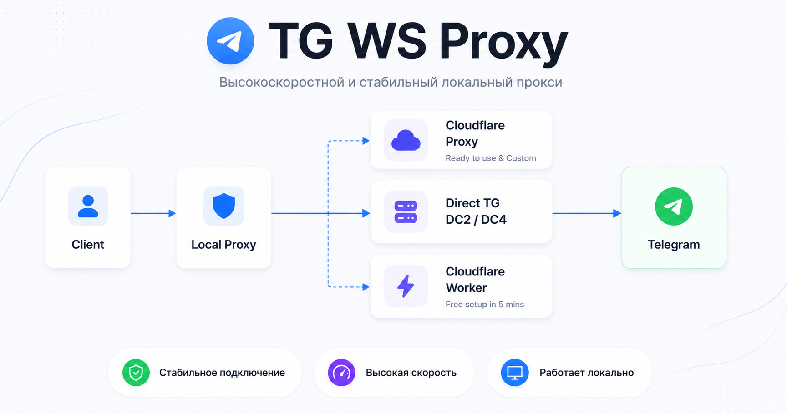
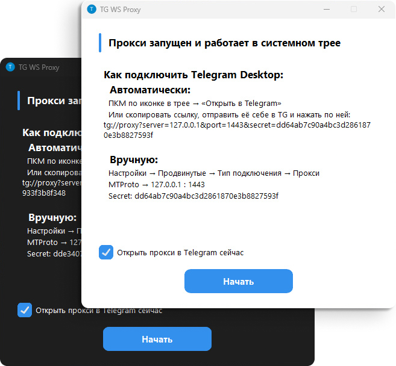

<div align="center">
	<br />
	<p>
		
	</p>
</div>

##

> [!TIP]
>
> ### [🎉 Поддержать меня](./Funding.md)
>
> **USDT (TRC20)**: `TXPnKs2Ww1RD8JN6nChFUVmi5r2hqrWjuu`  
> **BTC**: `bc1qr8vd6jelkyyry3m4mq6z5txdx4pl856fu6ss0w`  
> **ETH**: `0x1417878fdc5047E670a77748B34819b9A49C72F1`  
> **Другие монеты**: https://nowpayments.io/donation/flowseal

> [!CAUTION]
>
> ### Реакция антивирусов
>
> Антивирусы часто ошибочно помечают приложение как вирус из-за упаковщика.  
> Если вы не можете скачать из-за блокировки антивирусом, то:
>
> 1) **Попробуйте скачать версию для Windows 7 (по функциональности она не отличается)**
> 2) Отключите антивирус на время скачивания, добавьте файл в исключения и включите обратно  
>
> Всегда проверяйте, что скачиваете из интернета, тем более из непроверенных источников. Всегда лучше смотреть на детекты широко известных антивирусов на VirusTotal

# TG WS Proxy

**Локальный MTProto-прокси** для Telegram Desktop, который **ускоряет работу Telegram**, перенаправляя трафик через WebSocket-соединения. Данные передаются в том же зашифрованном виде, а для работы не нужны сторонние серверы.

<picture>
  <source srcset="./images/preview-dark.png" media="(prefers-color-scheme: dark)">
  
</picture>

## Навигация

- **🚀 Быстрый старт**
  - **[Windows](./README.windows.md)**
  - **[macOS](./README.macos.md)**
  - **[Linux](./README.linux.md)**
  - **[Docker](./README.docker.md)**
- [Настройка Cloudflare Worker'а (бесплатный аналог CF-прокси)](./CfWorker.md)
- [Настройка Cloudflare-домена (CF-прокси)](./CfProxy.md)
- [Fake TLS + upstream в Nginx](./FakeTlsNginx.md)
- [Файлы конфигурации Tray-приложения](./TrayConfig.md)
- [Установка из исходников](./BuildFromSource.md)
- [Руководство для контрибьюторов](../CONTRIBUTING.md)

## Windows: быстрый вход

Перейдите на [страницу релизов](https://github.com/Flowseal/tg-ws-proxy/releases) и скачайте:

- `TgWsProxy_windows.exe` (Windows 10+ x64)
- `TgWsProxy_windows_arm64.exe` (Windows 10+ ARM64)
- `TgWsProxy_windows_7_64bit.exe` (Windows 7 x64)
- `TgWsProxy_windows_7_32bit.exe` (Windows 7 x32)

При первом запуске откроется окно с инструкцией по подключению Telegram Desktop. **Приложение сворачивается в системный трей.**

### Меню трея

- **Открыть в Telegram** — автоматически настроить прокси через ссылку `tg://proxy`
- **Скопировать ссылку** — скопировать ссылку для подключения
- **Перезапустить прокси** — перезапуск без выхода из приложения
- **Настройки...** — GUI-редактор конфигурации (версия приложения, опциональная проверка обновлений с GitHub)
- **Открыть логи** — открыть файл логов
- **Выход** — остановить прокси и закрыть приложение

### Настройка Telegram Desktop

**Автоматическая настройка**

Щелкните правой кнопкой мыши по значку в трее и выберите **«Открыть в Telegram»**.

Если не сработало (Telegram не открылся с подключением), выполните шаги ниже:

1. Щелкните правой кнопкой мыши по значку в трее и выберите **«Скопировать ссылку»**
2. Отправьте ссылку в «Избранное» в Telegram и нажмите по ней левой кнопкой мыши
3. Подключитесь

**Ручная настройка**

1. Telegram → **Настройки** → **Продвинутые настройки** → **Тип подключения** → **Прокси**
2. Добавьте прокси:
   - **Тип:** MTProto
   - **Сервер:** `127.0.0.1` (или переопределенный вами)
   - **Порт:** `1443` (или переопределенный вами)
   - **Secret:** из настроек или логов

## Как это работает

```
Telegram Desktop → MTProto Proxy (127.0.0.1:1443) → WebSocket → Telegram DC
```

1. Приложение поднимает MTProto прокси на `127.0.0.1:1443`
2. Перехватывает подключения к IP-адресам Telegram
3. Извлекает DC ID из MTProto obfuscation init-пакета
4. Устанавливает WebSocket-соединение (TLS) к соответствующему DC через домены Telegram
5. Если WS недоступен (302 redirect) — автоматически переключается на CfProxy / прямое TCP-соединение

> [!IMPORTANT] 
> ### Не грузит фото/видео?
> **Удалите в настройках прокси в DC → IP всё, кроме `4:149.154.167.220`**  
> **Если это не помогло, полностью очистите это поле**  
> Подобная проблема встречается на аккаунтах без Premium  
> Если это не помогло, настройте собственный домен по инструкции: [CfProxy.md](./CfProxy.md)

## Автоматическая сборка

Проект содержит спецификации PyInstaller ([`packaging/windows.spec`](../packaging/windows.spec), [`packaging/macos.spec`](../packaging/macos.spec), [`packaging/linux.spec`](../packaging/linux.spec)) и GitHub Actions workflow ([`.github/workflows/build.yml`](../.github/workflows/build.yml)) для автоматической сборки.

Минимально поддерживаемые версии ОС для текущих бинарных сборок:

- Windows 10+ x64 для `TgWsProxy_windows.exe`
- Windows 10+ ARM64 для `TgWsProxy_windows_arm64.exe`
- Windows 7 (x64) для `TgWsProxy_windows_7_64bit.exe`
- Windows 7 (x32) для `TgWsProxy_windows_7_32bit.exe`
- Intel macOS 10.15+
- Apple Silicon macOS 11.0+
- Linux x86_64 (требуется AppIndicator для системного трея)

## Контрибьюторы

Спасибо всем, кто помогает развивать проект ❤️

<a href="https://github.com/Flowseal/tg-ws-proxy/graphs/contributors">
  
</a>

## Лицензия

[MIT License](../LICENSE)
